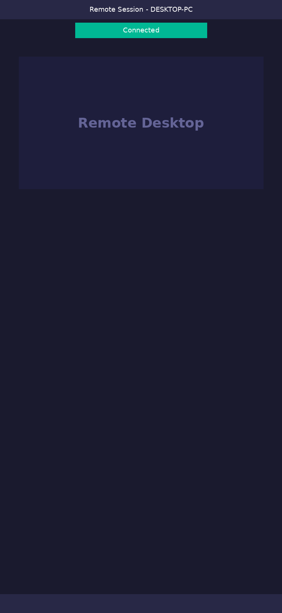
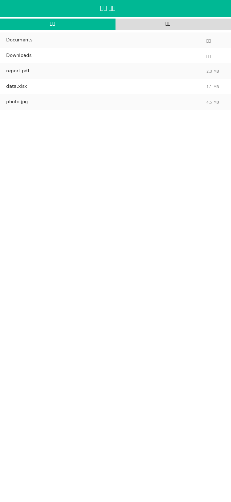

<p align="center">
  <br>
  <a href="#how-to-build">Build</a> •
  <a href="#build-with-docker">Docker</a> •
  <a href="#file-structure">Structure</a> •
  <a href="#screenshots">Screenshots</a>
</p>

> [!Caution]
> **Disclaimer:** <br>
> The developers of ShopRemote2 do not endorse or encourage any unethical or illegal use of this software. Misuse such as unauthorized access, control, or invasion of privacy is strictly against our guidelines. The authors are not responsible for any misuse of this application.

## About ShopRemote2

A remote desktop solution written in Rust. It works out of the box with no configuration required. You have full control of your data, with no security concerns. You can use the built-in rendezvous/relay server or set up your own server.

**Key Features:**
- Works out of the box, no configuration needed
- Self-hosted server support
- Supports Windows, macOS, Linux, Android, iOS
- File transfer, TCP tunneling, clipboard sharing
- High security and stability

## Dependencies

Desktop versions use Flutter or Sciter (deprecated) for the GUI. This guide covers Sciter only, as it is easier to get started with.

Download the Sciter dynamic library:

[Windows](https://raw.githubusercontent.com/c-smile/sciter-sdk/master/bin.win/x64/sciter.dll) |
[Linux](https://raw.githubusercontent.com/c-smile/sciter-sdk/master/bin.lnx/x64/libsciter-gtk.so) |
[macOS](https://raw.githubusercontent.com/c-smile/sciter-sdk/master/bin.osx/libsciter.dylib)

## How to Build

- Set up your Rust development environment and C++ build environment

- Install [vcpkg](https://github.com/microsoft/vcpkg) and set the `VCPKG_ROOT` environment variable correctly

  - Windows: vcpkg install libvpx:x64-windows-static libyuv:x64-windows-static opus:x64-windows-static aom:x64-windows-static
  - Linux/macOS: vcpkg install libvpx libyuv opus aom

- Run `cargo run`

## Build on Linux

### Ubuntu 18 (Debian 10)

```sh
sudo apt install -y zip g++ gcc git curl wget nasm yasm libgtk-3-dev clang libxcb-randr0-dev libxdo-dev \
        libxfixes-dev libxcb-shape0-dev libxcb-xfixes0-dev libasound2-dev libpulse-dev cmake make \
        libclang-dev ninja-build libgstreamer1.0-dev libgstreamer-plugins-base1.0-dev libpam0g-dev
```

### openSUSE Tumbleweed

```sh
sudo zypper install gcc-c++ git curl wget nasm yasm gcc gtk3-devel clang libxcb-devel libXfixes-devel cmake alsa-lib-devel gstreamer-devel gstreamer-plugins-base-devel xdotool-devel pam-devel
```

### Fedora 28 (CentOS 8)

```sh
sudo yum -y install gcc-c++ git curl wget nasm yasm gcc gtk3-devel clang libxcb-devel libxdo-devel libXfixes-devel pulseaudio-libs-devel cmake alsa-lib-devel gstreamer1-devel gstreamer1-plugins-base-devel pam-devel
```

### Arch (Manjaro)

```sh
sudo pacman -Syu --needed unzip git cmake gcc curl wget yasm nasm zip make pkg-config clang gtk3 xdotool libxcb libxfixes alsa-lib pipewire
```

### Install vcpkg

```sh
git clone https://github.com/microsoft/vcpkg
cd vcpkg
git checkout 2023.04.15
cd ..
vcpkg/bootstrap-vcpkg.sh
export VCPKG_ROOT=$HOME/vcpkg
vcpkg/vcpkg install libvpx libyuv opus aom
```

### Fix libvpx (for Fedora)

```sh
cd vcpkg/buildtrees/libvpx/src
cd *
./configure
sed -i 's/CFLAGS+=-I/CFLAGS+=-fPIC -I/g' Makefile
sed -i 's/CXXFLAGS+=-I/CXXFLAGS+=-fPIC -I/g' Makefile
make
cp libvpx.a $HOME/vcpkg/installed/x64-linux/lib/
cd
```

### Run Build

```sh
curl --proto '=https' --tlsv1.2 -sSf https://sh.rustup.rs | sh
source $HOME/.cargo/env
git clone --recurse-submodules https://github.com/ccaplee/shopremote2
cd shopremote2
mkdir -p target/debug
wget https://raw.githubusercontent.com/c-smile/sciter-sdk/master/bin.lnx/x64/libsciter-gtk.so
mv libsciter-gtk.so target/debug
VCPKG_ROOT=$HOME/vcpkg cargo run
```

## Build with Docker

Clone the repository and build the Docker container:

```sh
git clone https://github.com/ccaplee/shopremote2
cd shopremote2
git submodule update --init --recursive
docker build -t "shopremote2-builder" .
```

Then run the following command each time you want to build:

```sh
docker run --rm -it -v $PWD:/home/user/shopremote2 -v shopremote2-git-cache:/home/user/.cargo/git -v shopremote2-registry-cache:/home/user/.cargo/registry -e PUID="$(id -u)" -e PGID="$(id -g)" shopremote2-builder
```

The first build may take some time as dependency caches are created; subsequent builds will be faster. To pass additional arguments, append them to the end of the command. For example, add `--release` for an optimized release build. The resulting executable can be found in the target folder:

```sh
target/debug/shopremote2
```

For release builds:

```sh
target/release/shopremote2
```

Make sure to run these commands from the root of the ShopRemote2 repository, otherwise it may not find the required resources.

## File Structure

- **libs/hbb_common**: Video codec, config, tcp/udp wrapper, protobuf, fs functions for file transfer, and other utilities
- **libs/scrap**: Screen capture
- **libs/enigo**: Platform-specific keyboard/mouse control
- **libs/clipboard**: File copy/paste implementation for Windows, Linux, macOS
- **src/ui**: Sciter UI (deprecated)
- **src/server**: Audio/clipboard/input/video services and network connections
- **src/client.rs**: Starts peer connections
- **src/rendezvous_mediator.rs**: Communicates with rendezvous server, waits for remote direct (TCP hole punching) or relayed connections
- **src/platform**: Platform-specific code
- **flutter**: Flutter code for desktop and mobile
- **flutter/web/js**: JavaScript for Flutter web client

## Screenshots







